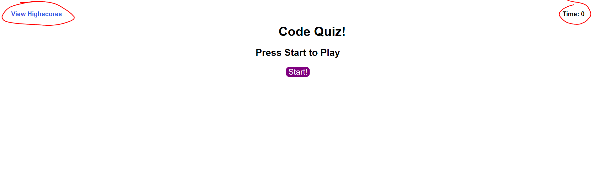
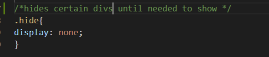
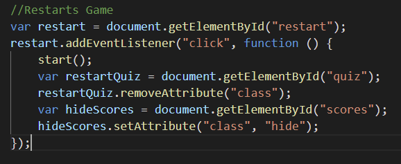

# Code Quiz Homework 4

The requirements for this homework was to create a Code Quiz without a starter code provided.

** The working solution can be found here:
https://jdroyko.github.io/codeQuiz/ **

Started by using the code from Activity 10 of Web API, Speed Reader in order to start utilizing the timer then build the rest of the code from there. 

Every correct answer is 10 points,
every incorrect response takes away 10 seconds.

The User Story is below:

## User Story

```
AS A coding boot camp student
I WANT to take a timed quiz on JavaScript fundamentals that stores high scores
SO THAT I can gauge my progress compared to my peers
```
The Acceptance Criteria for the project that guided the project. 

## Acceptance Criteria

```
GIVEN I am taking a code quiz
WHEN I click the start button
THEN a timer starts and I am presented with a question
WHEN I answer a question
THEN I am presented with another question
WHEN I answer a question incorrectly
THEN time is subtracted from the clock
WHEN all questions are answered or the timer reaches 0
THEN the game is over
WHEN the game is over
THEN I can save my initials and my score
```
# Screenshots 
This is the start screen when the page loads. It has the required elements of a timer and the ability to view high scores. 



I utilized hiding and showing the divs in various places to manipulate the screen in the CSS function then calling the divs in JavaScript.



In JavaScript I hide and show the divs as required for what is going on in the page as an example:



# Sources
*How to make a simple Javascript Quiz* https://simplestepscode.com/javascript-quiz-tutorial/#step1

*Simple JavaScript Quiz* https://www.sitepoint.com/simple-javascript-quiz/

Tutoring from - Professor, TA, and Kris Renaldi (Assigned tutor)